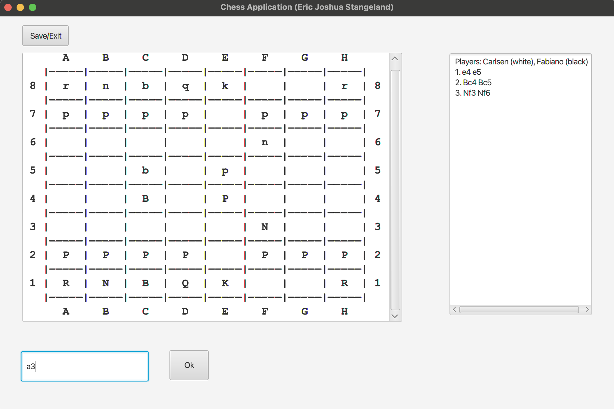
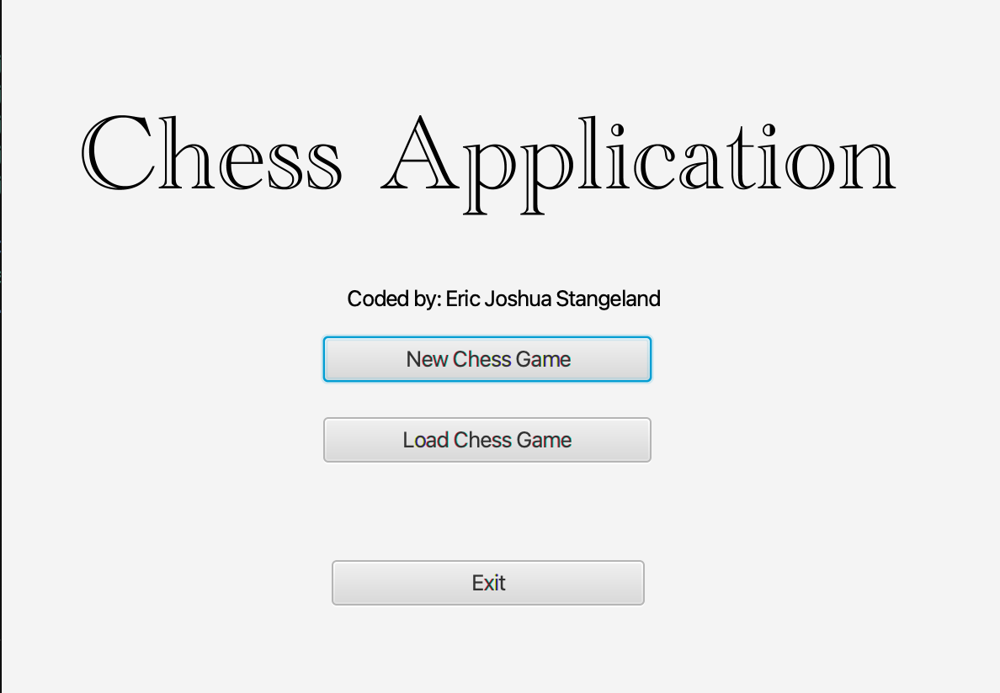
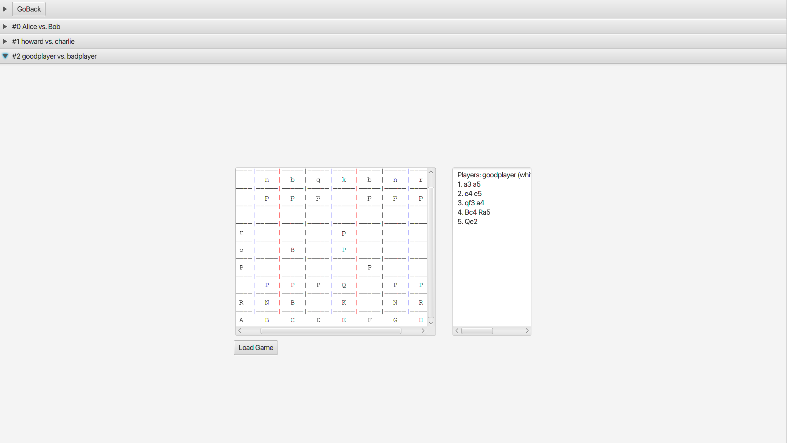

Dette var innleveringen min som prosjekt for faget objektorientert programmering vår 2024 NTNU.
# Chess Application
This application allows users to create chess games, save those chess games, and later load the chess games. The user interface is coded in JavaFX with corresponding controllers, while the internal methods for verifying moves and representing pieces are coded using object-oriented programming in java.
It uses a text input that takes in a move, in chess notation, and displays the board after the move. The move list is also given. 

## Main Interface
Below is how the application looks like when actually trying to make moves.

## Home Screen
The first interface the user is met with.

## Loaded Games
Below shows how the user is able to access games that have been saved.

